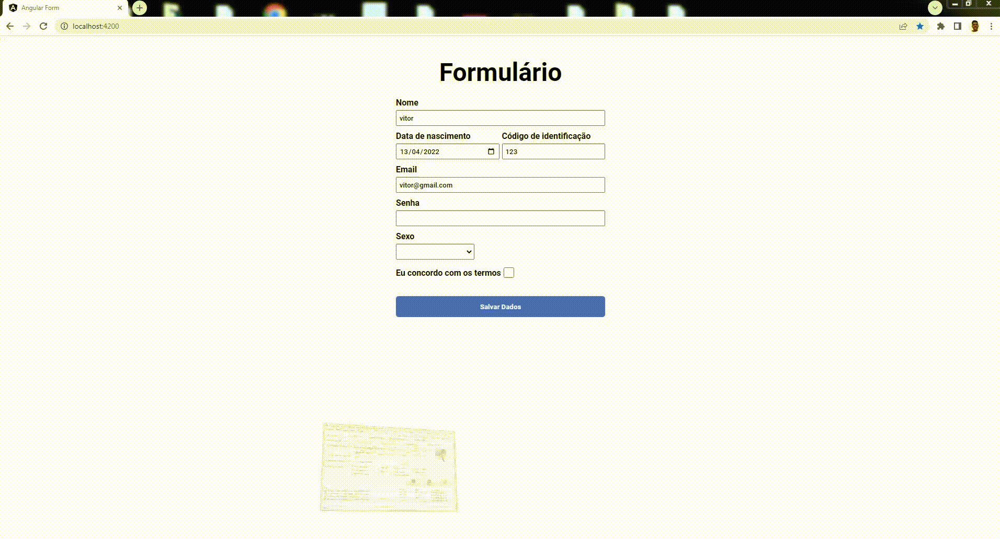

# Angular Form

Uma aplicação de formulário aonde o usuário digita suas informações que ficaram salvas no local storage permitindo que sejam consultadas e editadas mesmo após o fechamento do navegador angular js.

 

## SUMÁRIO

- Status
- Deploy
- Features
- Demonstração da Aplicação
- Como Rodar a Aplicação
- Pré Requisitos Para Rodar a Aplicação
- Tecnologias utilizadas
- Autor

## Status

✨Concluído ✨

## Features

- O usuário pode digitar suas informações em diferentes tipos de inputs.
- Quando o usuário marca salvar as informações ficam armazenadas no local storage.
- Quando salvas as informações os nputs são desativados.
- Ao abrir a apliação se houver informações no storage os inputs iniciam desativados.
- Senão houver informações no storage ao iniciar a aplicação os campos iniciam disponíveis para salvar os dados.
- Caso o usuário tente salvar as informações com algum item faltando é emitido um erro através de uma caixa de alerta.

## Demonstração da Aplicação



## Pré Requisitos Para Rodar a Aplicação

Você precisa de um browser de internet (navegador) e ter o node instalado na sua máquina.

## Como Rodar a Aplicação

Primeiro, para rodar o servidor de desenvolvimento, abra a pasta do projeto no seu terminal e rodo um dos seguintes comandos:

```bash
ng serve
```

Abra em [http://localhost:4200](http://localhost:4200) para ver a resposta do servidor no navegador.

## Tecnologias Utilizadas

- [Angular](https://angular.io/docs)
- [Css3](https://developer.mozilla.org/pt-BR/docs/Web/CSS)

## Autor


Feito por Vitor Mateus

[](https://www.instagram.com/vitor_dev_/) [](https://www.linkedin.com/in/vitor-mateus-2a42461a2/)


